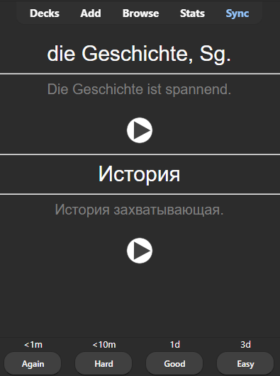

# Multi-LLM Anki Deck Generator v0

Automagically creates Anki vocabulary decks (`.apkg`) from a word list using:
*   LLM #1 for source example sentences.
*   LLM #2 for translation (word + sentence).
*   TTS (XTTSv2) for source & target audio.
*   SQLite DB for **resumable** progress.

**Sample Preview:**  


**Audio Samples:**  
- [▶️ German (DE) TTS Sample](sample_de.wav)  
- [▶️ Russian (RU) TTS Sample](sample_ru.wav)


**Requires:** Python, PyTorch, `transformers`, `TTS`, `genanki`, `icecream`, `espeak-ng`.

**Run:**
```bash
python anki_deck_generator.py test.txt  
```
**Tips:**
*   Use `uv` for fast environment setup (`uv venv && uv sync`).
*   Use VS Code Dev Containers for a pre-built environment.
*   Setup your huggegingface token
*   PyTorch inside the container works smoothly with CUDA if the GPU supports it. Locally, you might need to tweak drivers and versions.